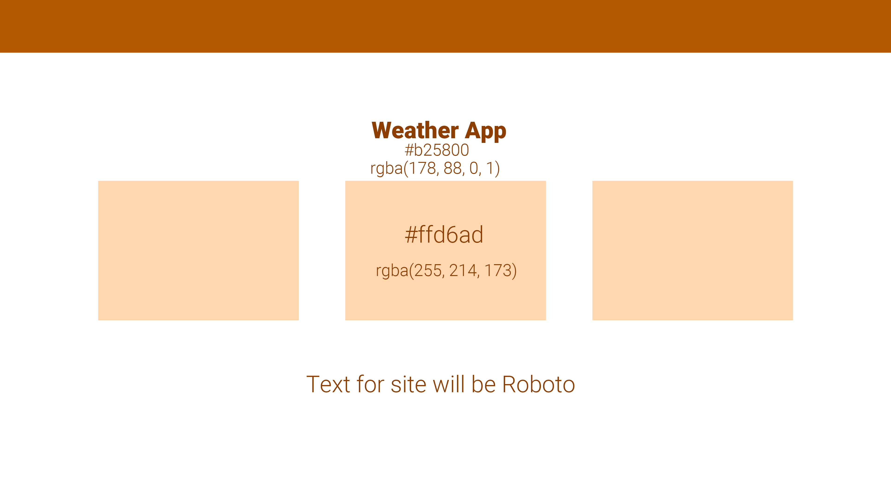

#CopyWrite - Emilie Öst
# Fullstack Project

### This project will persist of a frontend in VueJs, Backend in Express Js and database in MongoDB

# Planning

For the past year I have learnt React, Express, MongoDB
In this project I will develop my own knowledge especially using Vue since I haven't used it before.

So my project will consist of a database in MongoDB which I will manage in Docker\
My backend will consist of a server in JavaScript using Express\
Frontend will then of course be using VueJs\
Last but not least I will host my files on GitHub for the public\
I will also try out Asana for project-planning

---

So the plan is to make a backend in Server.js in my backend-directory. This will be used as a bridge
between my database and frontend. What will exist in my backend-directory is following: \
NPM - 
Express to listen for ports and get information using CRUD

# Desired Outcome
I will be designing a database that tells what weather it is, with CRUD you can update and input the
weather. You can also delete a specific weather.
I am thinking of firstly making a page where I can see that everything is working\
Then I want to add content like icons and images to make it more lively.

I'm thinking of an orange theme, soft orange: `#ffd6ad - rgba(255, 214, 173, 1)`\
Navigation using a darker, harder orange: `#b25800, rgba(178, 88, 0, 1)`

## Wireframes

